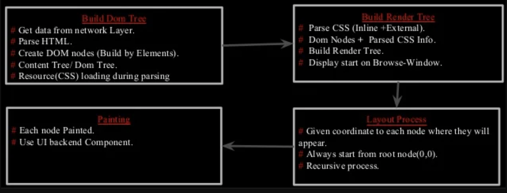
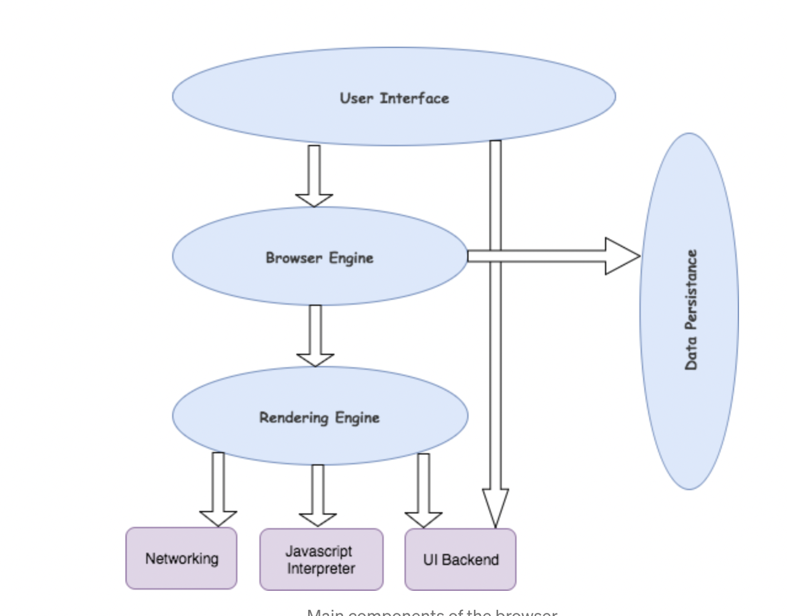
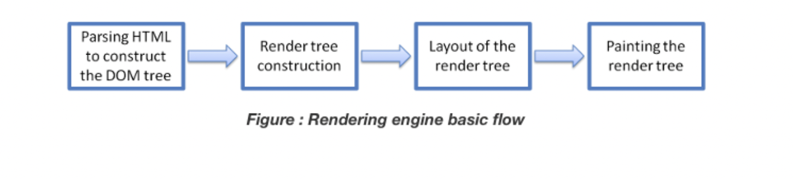
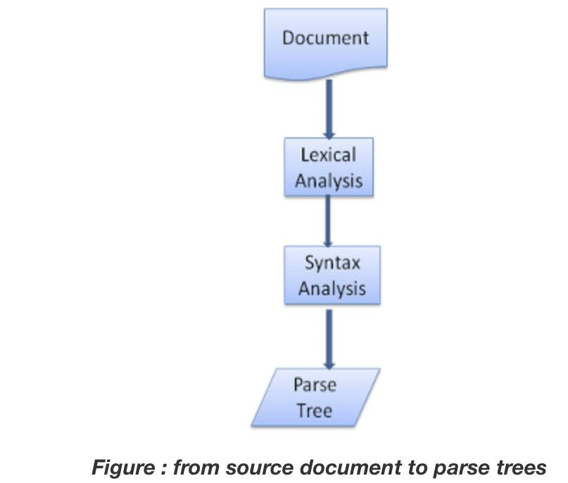
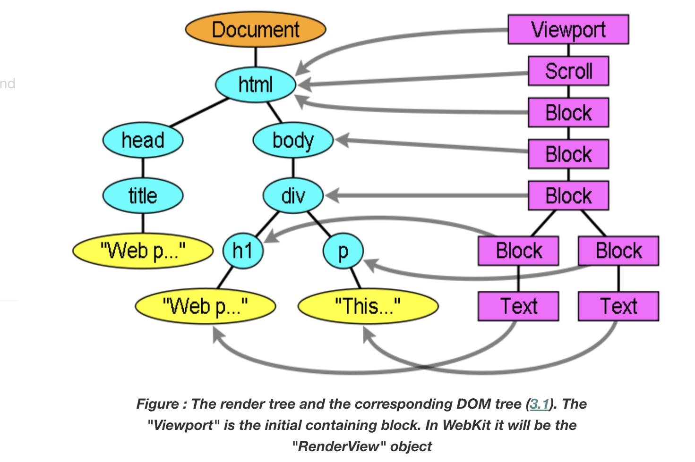

A)What is the main functionality of the browser?

A browser is a software application used to locate, retrieve and display content on the World Wide Web, 
including Web pages, images, video and other files.

Below is image demonstrating the Browser process flow from url to web page rendering.

B)High Level Components of a browser:

Below are the different components of browser:

1)The User Interface: The user interface is the space where User interacts with the browser. It includes the address bar, back and next buttons, home button, refresh and stop, bookmark option, etc.

2)The Browser Engine: The browser engine works as a bridge between the User interface and the rendering engine.

3)The Rendering Engine: The rendering engine, as the name suggests is responsible for rendering the requested web page on the browser screen.

4)Networking: Component of the browser which retrieves the URLs using the common internet protocols of HTTP or FTP. The networking component handles all aspects of Internet communication and security. 

5)JavaScript Interpreter: It is the component of the browser which interprets and executes the javascript code embedded in a website. The interpreted results are sent to the rendering engine for display. 

6)UI Backend: UI backend is used for drawing basic widgets like combo boxes and windows.

7)Data Persistence/Storage: This is a persistence layer. Browsers support storage mechanisms such as localStorage, IndexedDB, WebSQL and FileSystem. It is a small database created on the local drive of the computer where the browser is installed.

Attached image:

C)Rendering engine and its use:

Once a user requests a particular document, the rendering engine starts fetching the content of the requested document. This is done via the networking layer. 

The four basic steps include:
1)The requested HTML page is parsed in chunks, including the external CSS files and in style elements, by the rendering engine. The HTML elements are then converted into DOM nodes to form a “content tree” or “DOM tree.”

2)Simultaneously, the browser also creates a render tree. This tree includes both the styling information as well as the visual instructions that define the order in which the elements will be displayed.

3)Further, the render tree goes through the layout process. When a render tree is created, the position or size values are not assigned. The entire process of calculating values for evaluating the desired position is called a layout process. 

4)The final step is to paint the screen, wherein the render tree is traversed, and the renderer’s paint() method is invoked, which paints each node on the screen using the UI backend layer.

Different browsers user different rendering engines:
* Internet Explorer: Trident
* Firefox & other Mozilla browsers: Gecko
* Chrome & Opera 15+: Blink
*  Chrome (iPhone) & Safari: Webkit

Below is the redering engine workflow diagram:

D)Parsers:
Parsing means analyzing and converting a program into an internal format that a runtime environment can actually run, for example the Javascript engine inside browsers
Parsing process can be separated in two processes:
1)Lexical Analysis: Lexical analysis is the process of breaking the input into tokens.
2)Syntax analysis: Syntax analysis is the applying of the language syntax rules.

The parser will usually ask the lexer for a new token and try to match the token with one of the syntax rules. If a rule is matched, a node corresponding to the token will be added to the parse tree and the parser will ask for another token.

Attached image:

E)Tree construction:

The CSSOM and DOM trees are combined into a render tree, which is then used to compute the layout of each visible element and serves as an input to the paint process that renders the pixels to screen. Optimizing each of these steps is critical to achieving optimal rendering performance.

Firefox calls the elements in the render tree "frames". WebKit uses the term renderer or render object.

F)Order of script processing:
The model of the web is synchronous.
Scripts:
The parsing of the document halts until the script has been executed. If the script is external then the resource must first be fetched from the network–this is also done synchronously, and parsing halts until the resource is fetched.Authors can add the "defer" attribute to a script, in which case it will not halt document parsing and will execute after the document is parsed.

Style sheets:
Conceptually it seems that since style sheets don't change the DOM tree, there is no reason to wait for them and stop the document parsing. There is an issue, though, of scripts asking for style information during the document parsing stage.

G)Layout and Painting:
When the renderer is created and added to the tree, it does not have a position and size. Calculating these values is called layout or reflow.
HTML uses a flow based layout model, meaning that most of the time it is possible to compute the geometry in a single pass. Elements later ``in the flow'' typically do not affect the geometry of elements that are earlier ``in the flow'', so layout can proceed left-to-right, top-to-bottom through the document. 

Browser paints pixel by pixel to create the visual representation we see on the screen.
The final step is to paint the screen which paints each node on the screen using the UI backend layer.

